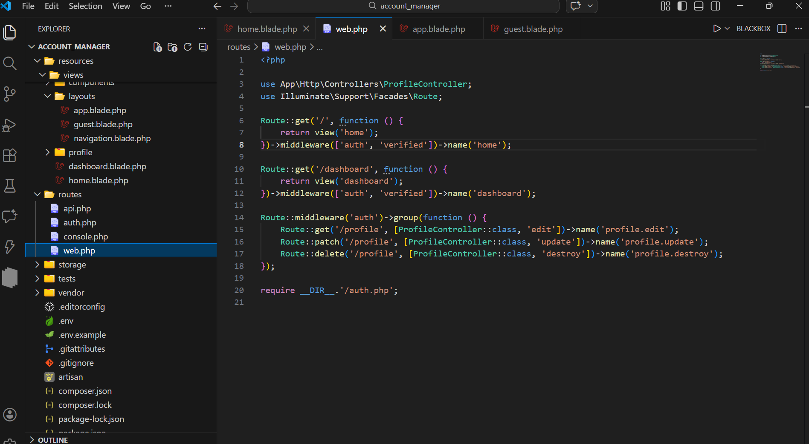
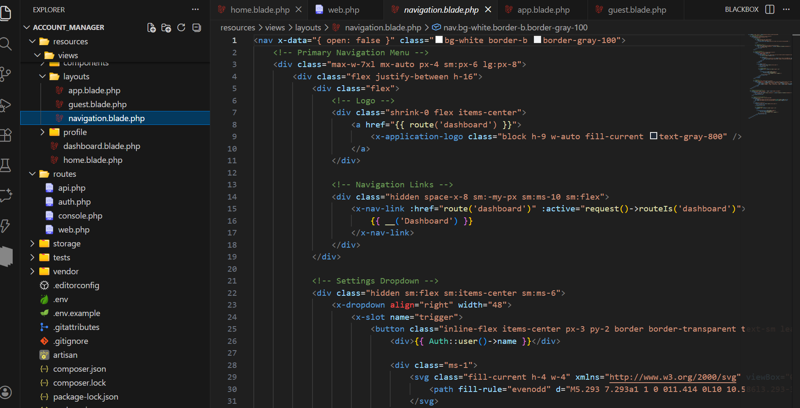

# Devil Pro Ultimate - Best Dark Theme

Devil dark theme with ultimate color combination for VSCode. Deep abyss backgrounds, hellfire accents.

## Features
- Full UI coverage (editor, sidebar, terminal, git, search, notifications).
- Precise syntax highlighting (JS/TS, HTML/CSS, PHP, Python, JSON, Markdown, Regex).
- High contrast (WCAG AA+), low eye strain.
- Distinct colors: fiery red keywords, gold strings, cyan functions, neon green numbers.

## Installation
1. Reload VSCode (Ctrl+Shift+P → \"Developer: Reload Window\").
2. Ctrl+Shift+P → \"Preferences: Color Theme\" → **Devil Pro Ultimate**.

## Screenshots

*Update screenshots to match new palette.*

## Release Notes

- **v1.1.0**: new colors and new look theme, accessibility,screenshots update and bug fix.
- v1.0.2: More colors, performance.
- v1.0.1: Bug fixes.
- v0.0.1: Initial.

**Enjoy the ultimate devilish coding! 🔥**

[Repository](https://github.com/php-point/devil-dark-theme)
